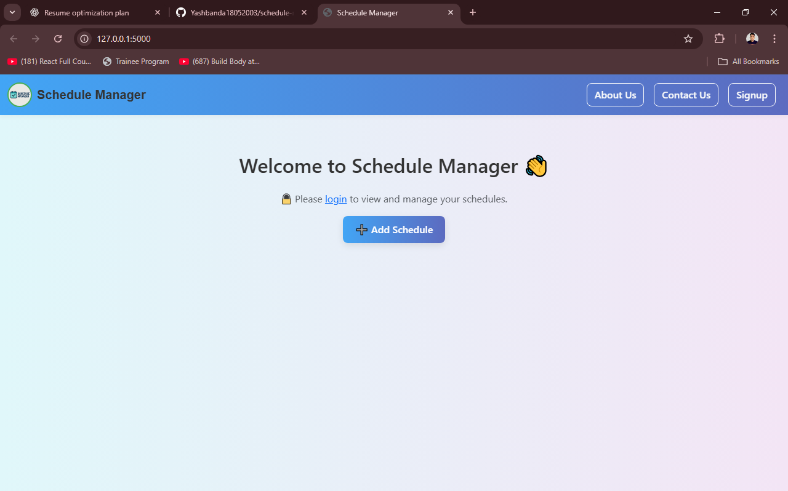
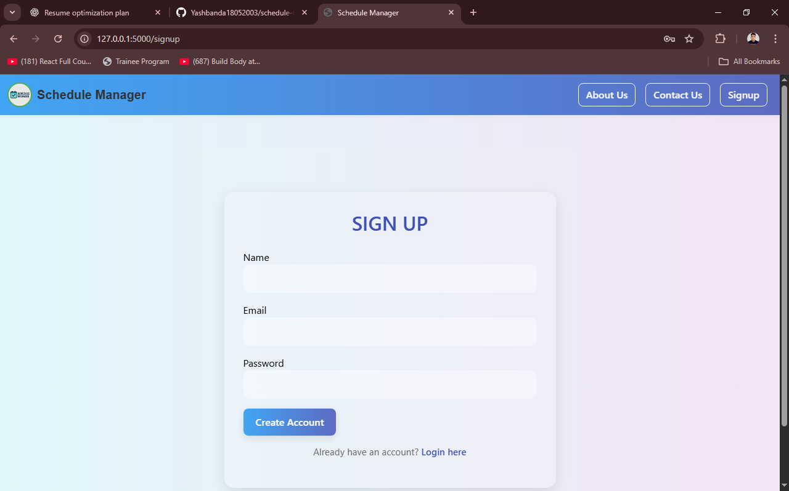
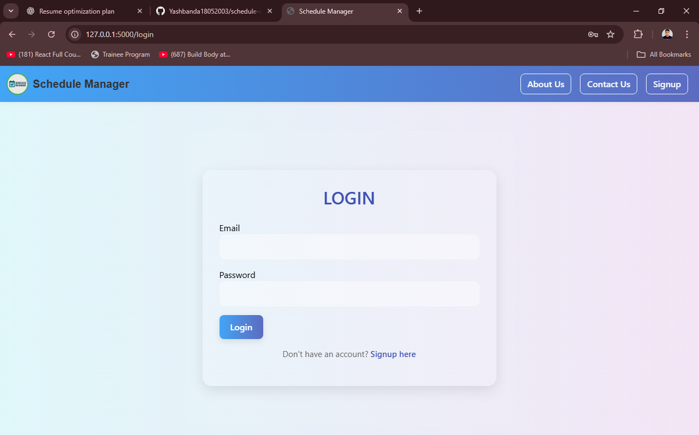
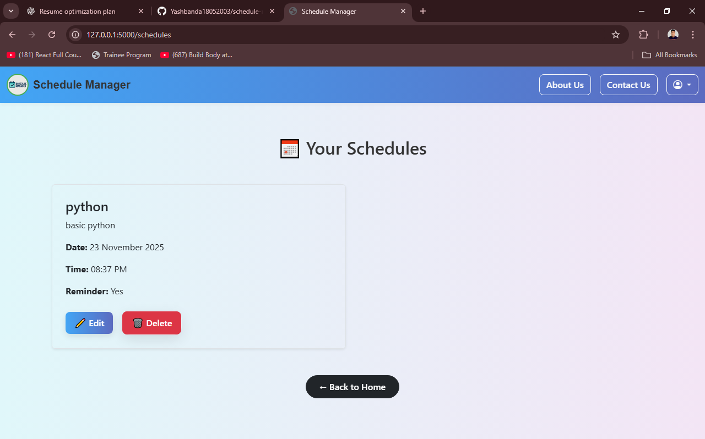
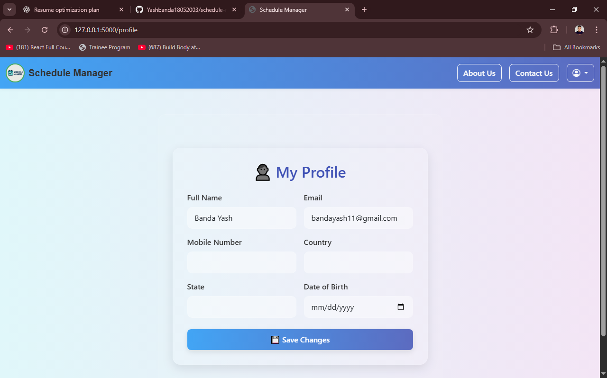

📌 Schedule Manager Web App

A simple and efficient schedule management platform built with Flask.
Users can create tasks, set reminders, and receive email/SMS notifications automatically.

🚀 Features

Add, edit, delete tasks

Set reminders

Email notifications using Flask-Mail

SMS notifications

Responsive UI (Bootstrap)

SQLite database

User-friendly and fast

🧩 Tech Stack

Backend: Flask, SQLAlchemy

Frontend: Bootstrap, HTML, CSS

Database: SQLite

Notifications: Email (Flask-Mail), SMS API

/project
│──── /static
│──── /templates
│──── app.py
│──── models.py
│──── utils.py

pip install -r requirements.txt
python app.py

